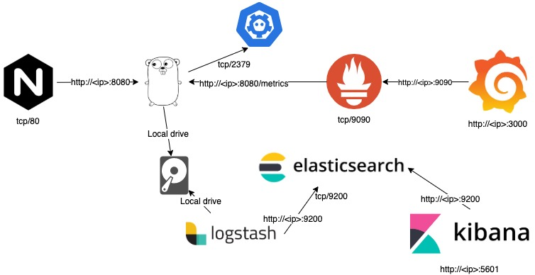
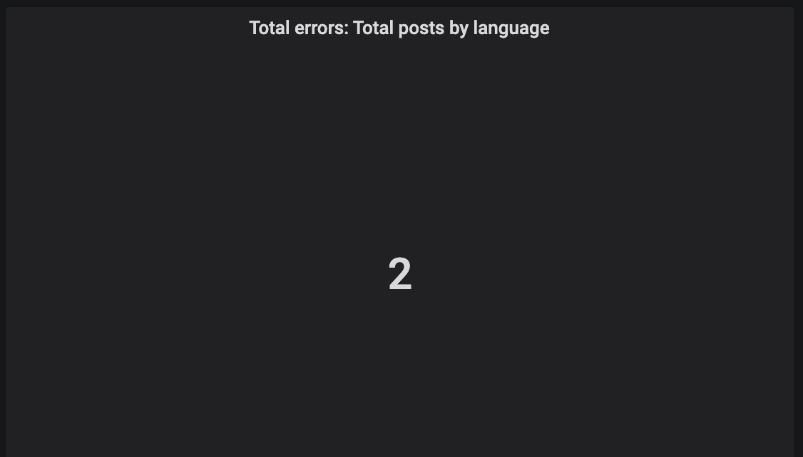

# Crawler Tags

## Projeto
Esse projeto coleta as últimas mensagens postadas no Twitter referente as hashtags:

- openbanking
- apifirst
- devops
- cloudfirst
- microservices
- apigateway
- oauth
- swagger
- raml
- openapis

## API

### Cinco usuários com mais seguidores
- /api/topfollowers
- GET
- Content-Type: application/json

Response:
```
[{"followers_count":52380,"user":"usuário1"},{"followers_count":52380,"user":"usuário2"},{"followers_count":25044,"user":"usuário3"},{"followers_count":20393,"user":"usuário4"},{"followers_count":18355,"user":"usuário5"}]
```

Print da tela

___

### Total de postagens agrupadas por hora do dia
- /api/postsummarized
- GET
- Content-Type: application/json

Response:
```
[{"Total":2,"Hour":2},{"Total":5,"Hour":16},{"Total":1,"Hour":19},{"Total":2,"Hour":18},{"Total":2,"Hour":4},{"Total":3,"Hour":9},{"Total":4,"Hour":20},{"Total":18,"Hour":12},{"Total":2,"Hour":11},{"Total":3,"Hour":8},{"Total":3,"Hour":7},{"Total":7,"Hour":15},{"Total":1,"Hour":3},{"Total":3,"Hour":10},{"Total":3,"Hour":14},{"Total":64,"Hour":22},{"Total":16,"Hour":21},{"Total":3,"Hour":17},{"Total":6,"Hour":13},{"Total":1,"Hour":23}]
```

Print da tela

___

### Total de postagens para cada uma das hashtags por idioma
- /api/totalpostslang
- GET
- Content-Type: application/json

Response:
```
[{"Hashtag":"openbanking","LangCount":[{"Lang":"en","Total":15}]},{"Hashtag":"apifirst","LangCount":[{"Lang":"en","Total":14},{"Lang":"und","Total":1}]},{"Hashtag":"devops","LangCount":[{"Lang":"en","Total":15}]},{"Hashtag":"cloudfirst","LangCount":[{"Lang":"en","Total":14},{"Lang":"und","Total":1}]},{"Hashtag":"microservices","LangCount":[{"Lang":"en","Total":15}]},{"Hashtag":"apigateway","LangCount":[{"Lang":"en","Total":9},{"Lang":"es","Total":3},{"Lang":"ja","Total":3}]},{"Hashtag":"oauth","LangCount":[{"Lang":"en","Total":1},{"Lang":"ja","Total":14}]},{"Hashtag":"swagger","LangCount":[{"Lang":"en","Total":14},{"Lang":"es","Total":1}]},{"Hashtag":"raml","LangCount":[{"Lang":"es","Total":1},{"Lang":"in","Total":1},{"Lang":"ja","Total":13}]},{"Hashtag":"openapis","LangCount":[{"Lang":"en","Total":14}]}]
```

Print da tela


## Arquitetura



## Gerando a Imagem


### Subindo local

Requisitos mínimos:
```
- Linux ou Mac
- Acesso à internet
- git instalado
- docker instalado e configurado
- executar com o usuário configurado para o docker ou root
```

- Clonar o projeto
```
$ git clone git@github.com:caiotedim/crawler-tags.git
```

- dentro do diretório do projeto
```
$ cd crawler-tags
```

- executar
```
$ make build
```

- Validar a imagem gerada localmente
```
$ docker images |grep crawler tags
```

## Executar a aplicação

Antes de subir a aplicação é necessário configurar 5 variáveis, são elas:
```
IPADDRESS=<IP da máquina local>
CONSUMER_API_KEY="Twitter token"
CONSUMER_API_SECRET="Twitter token"
ACCESS_TOKEN_KEY="Twitter token"
ACCESS_TOKEN_SECRET="Twitter token"
```

Essas variáveis deverão ser alteradas no arquivo de _Makefile_ localizado na raiz do projeto, logo no início do arquivo

Com a imagem já gerada localmente execute:
```
$ make start
```

Caso dê tudo certo deverá aparecer algo como a imagem abaixo:


Para parar a aplicação execute
```
$ make stop
```

### Fazendo o deploy na AWS
Requisitos mínimos:
```
- Linux ou Mac
- Acesso à internet
- git instalado
- docker instalado e configurado
- executar com o usuário configurado para o docker ou root
- ansible >= 2.9
- terraform >= 0.12
- chaves da aws configuradas
```

- Clonar o projeto
```
$ git clone git@github.com:caiotedim/crawler-tags.git
```

- dentro do diretório do terraform
```
$ cd crawler-tags/deploy/terraform
```

- Iniciar o terraform
```
$ terraform init
```

- Fazer o plan do terraform (opcional)
```
$ terraform plan
```

- Fazer o apply do terraform
```
$ terraform apply
```

- O terraform irá subir uma instância em uma vpc 10.0.0.0/24

- Antes de executar o ansible, é necessário criar um arquivo na raiz do ansible com o nome de `.ansible.vault` com o conteúdo
```
123456
```

- Execute o ansible
```
$ cd ../ansible
$ ansible-playbook -i inventory/aws_ec2.yaml main.yaml
```
___
## Segue alguns prints dos logs e o dashboard

- Iniciando a aplicação


- Erro ao acessar o etcd3


Para reprodução desse log necessário parar o etcd3
```
$ docker stop etcd3
```
___

- Latência: total de postagens agrupadas por hora do dia


- Erros: total de postagens agrupadas por hora do dia


- Latência: cinco usuários que mais possuem seguidores da amostra coletada


- Erros: cinco usuários que mais possuem seguidores da amostra coletada


- Latência: total de postagens para cada uma das hashtags por idioma


- Erros: total de postagens para cada uma das hashtags por idioma

